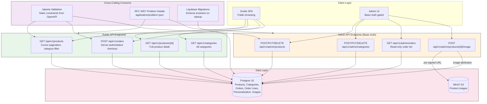

# Clothingshop — Backend Product Requirements Document

## Visual Overview



## Context

**Product name:** Clothingshop
**Backend role:** Spring Boot REST API serving an alternative clothing e-commerce frontend
**Scope:** MVP — minimal operational overhead, contract-first API design, server-authoritative data integrity.

This document captures the backend requirements for the Clothingshop MVP. It was developed through a structured brainstorming process (see `brainstorm-backend-session.md`) that resolved tensions between API contract fidelity, data modeling for clothing personalization, and the trust boundary between client-side cart state and server-side order creation. The core tension was discipline vs. velocity — every decision landed on the side of a strict API contract enforced through OpenAPI code generation, while keeping v1 operational scope intentionally minimal.

---

## 1. Goals & Non-Goals

### Goals

- The system SHALL expose a RESTful API for product browsing, category navigation, and order placement
- The system SHALL enforce the API contract through OpenAPI-first development with code generation
- The system SHALL provide admin endpoints for product, category, and image management gated by HTTP Basic authentication
- The system SHALL implement server-authoritative pricing at checkout — the client SHALL NOT submit prices
- The system SHALL store per-item personalization data (silhouette, measurements) as first-class data
- The system SHALL use cursor-based pagination via Spring `Slice<>` for all list endpoints
- The system SHALL report all errors as RFC 9457 Problem Details responses
- The system SHALL manage database schema evolution through Liquibase migrations

### Non-Goals

- User accounts / authentication beyond HTTP Basic for admin (v1)
- Payment gateway integration (v1)
- Order status transitions beyond PLACED (v1 — schema-ready, API deferred)
- Full-text search or advanced product filtering beyond category
- Inventory or stock tracking
- Rate limiting or abuse prevention
- Multi-language or multi-currency support
- WebSocket or server-push communication

---

## 2. API Design Principles

### 2.1 Contract-First OpenAPI

- The system SHALL define the complete API contract in `openapi/spec.yaml` before any endpoint implementation
- When the system generates code, it SHALL produce Java interfaces and DTOs for the backend from the OpenAPI spec
- The system SHALL generate TypeScript types and HTTP client for the frontend from the same OpenAPI spec
- The generated code SHALL be excluded from version control; generation SHALL be a build prerequisite

### 2.2 API Versioning

- All API endpoints SHALL be prefixed with `/api/v1/`
- The system SHALL NOT implement header-based or query-parameter versioning in v1
- When a future version is introduced, v1 endpoints SHALL remain accessible until explicitly deprecated

### 2.3 Error Contract

- When the system returns an error, it SHALL produce an RFC 9457 Problem Details response
- All error responses SHALL use the content type `application/problem+json`
- The error response SHALL contain the following fields:

| Field | Required | Description |
|-------|----------|-------------|
| `type` | Yes | URI identifying the error category (e.g., `https://example.com/errors/validation`) |
| `title` | Yes | Short human-readable summary of the error type |
| `status` | Yes | HTTP status code |
| `detail` | Yes | Specific explanation of this occurrence |
| `instance` | No | URI of the specific request that caused the error |

- When the system detects a validation error, it SHALL return HTTP 422 with a Problem Details response that includes a `fields` extension member listing per-field errors:

```json
{
  "type": "https://example.com/errors/validation",
  "title": "Validation Error",
  "status": 422,
  "detail": "Request body contains invalid fields",
  "fields": [
    { "field": "items[0].personalization.waistCm", "message": "must be between 40 and 200" }
  ]
}
```

- When the system cannot find a requested resource, it SHALL return HTTP 404 with a Problem Details response
- When the system receives an unauthenticated request to an admin endpoint, it SHALL return HTTP 401
- When the system receives an unauthorized request, it SHALL return HTTP 403

### 2.4 Validation Layers

The system SHALL implement validation in two layers:

| Layer | Mechanism | Scope | Defined in |
|-------|-----------|-------|------------|
| Static | Jakarta Validation (generated from OpenAPI constraints) | Field-level: required, enum, ranges, formats | OpenAPI spec |
| Business | Service-layer validation | Cross-field rules, business invariants | Application code |

- The system SHALL reject invalid requests at the earliest possible layer
- When static validation fails, the system SHALL return 422 before executing any business logic

---

## 3. Functional Requirements

### 3.1 Public API — Product Catalog

#### 3.1.1 List Products

- The system SHALL expose `GET /api/v1/products` returning a cursor-paginated list of products
- The system SHALL use Spring `Slice<>` for pagination — no COUNT query SHALL be executed
- The system SHALL accept the following query parameters:

| Parameter | Required | Type | Description |
|-----------|----------|------|-------------|
| `cursor` | No | string | Opaque cursor from previous response; omit for first page |
| `limit` | No | integer | Page size; default 20, maximum 100 |
| `category` | No | string | Category slug to filter by |

- When `category` is provided, the system SHALL return only products belonging to that category
- When `category` does not match any existing category, the system SHALL return an empty result set (not an error)
- The system SHALL return products ordered by creation timestamp descending (newest first)

**Response schema:**

| Field | Type | Description |
|-------|------|-------------|
| `items` | array | List of product summaries |
| `items[].id` | UUID | Product identifier |
| `items[].name` | string | Product name |
| `items[].price` | decimal | Current price (two decimal places) |
| `items[].imageUrl` | string \| null | Primary product image URL; null if no image |
| `items[].shortDescription` | string | Truncated product description |
| `items[].category` | object | Category the product belongs to |
| `items[].category.slug` | string | Category URL slug |
| `items[].category.name` | string | Category display name |
| `nextCursor` | string \| null | Opaque cursor for next page; null if no more results |
| `hasMore` | boolean | Whether additional pages exist |

#### 3.1.2 Get Product Detail

- The system SHALL expose `GET /api/v1/products/{id}` returning full product information
- When the requested product does not exist, the system SHALL return HTTP 404 with Problem Details

**Response schema:**

| Field | Type | Description |
|-------|------|-------------|
| `id` | UUID | Product identifier |
| `name` | string | Product name |
| `description` | string | Full product description |
| `price` | decimal | Current price |
| `images` | array | Ordered list of product images |
| `images[].id` | UUID | Image identifier |
| `images[].url` | string | Image URL |
| `images[].alt` | string \| null | Alt text for accessibility |
| `category` | object | Category the product belongs to |
| `category.slug` | string | Category URL slug |
| `category.name` | string | Category display name |
| `fabrication` | object \| null | Material and construction details |
| `fabrication.content` | string | Fabric composition |
| `fabrication.care` | string | Care instructions |
| `ethics` | object \| null | Environmental and production details |
| `ethics.origin` | string | Production origin |
| `ethics.impact` | string | Environmental impact statement |

#### 3.1.3 List Categories

- The system SHALL expose `GET /api/v1/categories` returning all product categories
- The system SHALL return categories ordered by display order

**Response schema:**

| Field | Type | Description |
|-------|------|-------------|
| `items` | array | List of categories |
| `items[].id` | UUID | Category identifier |
| `items[].name` | string | Category display name (e.g., "Tops") |
| `items[].slug` | string | URL-safe slug (e.g., "tops") |
| `items[].description` | string \| null | Optional category description |
| `items[].productCount` | integer | Number of products in this category |

---

### 3.2 Public API — Checkout & Orders

#### 3.2.1 Place Order

- The system SHALL expose `POST /api/v1/orders` for order placement
- The system SHALL NOT accept prices from the client — all pricing SHALL be resolved server-side from the current database values
- When the system processes an order, it SHALL:

  1. Validate all fields via Jakarta Validation (static layer)
  2. Look up each referenced product by ID
  3. Resolve the current price for each product from the database
  4. Validate that all products exist and are available
  5. Persist the order with status PLACED
  6. Return the order confirmation with resolved prices

**Request schema:**

| Field | Type | Required | Description |
|-------|------|----------|-------------|
| `customer` | object | Yes | Customer information |
| `customer.fullName` | string | Yes | Full name, 2-200 characters |
| `customer.email` | string | Yes | Valid email address |
| `customer.shippingAddress` | string | Yes | Shipping address, 10-500 characters |
| `items` | array | Yes | Non-empty array of order items |
| `items[].productId` | UUID | Yes | Reference to an existing product |
| `items[].personalization` | object | Yes | Per-item personalization data |
| `items[].personalization.silhouette` | enum | Yes | One of: `BOXY`, `CURVY`, `OTHER` |
| `items[].personalization.waistCm` | decimal | No | Range: 40.0 – 200.0 |
| `items[].personalization.hipsCm` | decimal | No | Range: 50.0 – 200.0 |
| `items[].personalization.heightCm` | decimal | No | Range: 100.0 – 250.0 |

**Error scenarios:**

| Condition | HTTP Status | Error type |
|-----------|-------------|------------|
| Validation failure (static) | 422 | `validation` |
| One or more products not found | 422 | `unavailable-items` |
| Empty items array | 422 | `validation` |
| Duplicate product in items | 422 | `validation` |

- When one or more referenced products do not exist, the system SHALL return HTTP 422 with a Problem Details response that includes an `unavailableItems` extension member listing the unavailable product IDs:

```json
{
  "type": "https://example.com/errors/unavailable-items",
  "title": "Unavailable Items",
  "status": 422,
  "detail": "Some items in your order are no longer available",
  "unavailableItems": [
    { "productId": "abc-123", "productName": "Obsidian Blazer" }
  ]
}
```

**Response schema (HTTP 201):**

| Field | Type | Description |
|-------|------|-------------|
| `id` | UUID | Order identifier |
| `status` | string | Always `PLACED` in v1 |
| `customer` | object | Echo of submitted customer data |
| `items` | array | Order items with resolved prices |
| `items[].productId` | UUID | Product reference |
| `items[].productName` | string | Product name at time of order |
| `items[].price` | decimal | Unit price resolved from database |
| `items[].personalization` | object | Echo of submitted personalization |
| `totalPrice` | decimal | Sum of all item prices |
| `createdAt` | ISO 8601 | Timestamp of order creation |

---

### 3.3 Admin API — Authentication

- All admin endpoints (`/api/v1/admin/**`) SHALL require HTTP Basic authentication
- The system SHALL validate credentials against a configurable username/password store
- The system SHALL reject unauthenticated requests with HTTP 401 and a `WWW-Authenticate: Basic realm="Clothingshop Admin"` header
- Admin credentials SHALL be configurable via environment variables:

| Variable | Purpose |
|----------|---------|
| `ADMIN_USERNAME` | Admin username |
| `ADMIN_PASSWORD` | Admin password |

- The system SHALL log all failed authentication attempts

---

### 3.4 Admin API — Product Management

#### 3.4.1 Create Product

- The system SHALL expose `POST /api/v1/admin/products`
- When a product is created, the system SHALL assign a server-generated UUID

**Request schema:**

| Field | Type | Required | Description |
|-------|------|----------|-------------|
| `name` | string | Yes | Product name, 2-200 characters |
| `description` | string | Yes | Full product description, 10-5000 characters |
| `shortDescription` | string | Yes | Truncated description for list view, 10-300 characters |
| `price` | decimal (string) | Yes | Price as string (e.g., "299.99"), must be > 0, two decimal places, stored as BigDecimal |
| `currency` | string | No | Currency code, default "PLN", 3 characters |
| `categoryId` | UUID | Yes | Reference to existing category |
| `sku` | string | No | Stock keeping unit, max 100 characters, must be unique if provided |
| `isActive` | boolean | No | Whether product is publicly visible, default true |
| `fabrication` | object | No | Material and construction details |
| `fabrication.content` | string | No | Fabric composition, max 500 characters |
| `fabrication.care` | string | No | Care instructions, max 500 characters |
| `ethics` | object | No | Environmental and production details |
| `ethics.origin` | string | No | Production origin, max 200 characters |
| `ethics.impact` | string | No | Environmental impact, max 500 characters |

#### 3.4.2 Update Product

- The system SHALL expose `PUT /api/v1/admin/products/{id}`
- The system SHALL accept partial updates — only non-null fields in the request body SHALL be updated
- When the referenced product does not exist, the system SHALL return HTTP 404
- When a SKU change results in a duplicate, the system SHALL return HTTP 422

**Update request schema** (all fields optional):

| Field | Type | Required | Description |
|-------|------|----------|-------------|
| `name` | string | No | Product name, 2-200 characters |
| `description` | string | No | Full product description |
| `shortDescription` | string | No | Truncated description |
| `price` | decimal (string) | No | Price as string |
| `currency` | string | No | Currency code |
| `categoryId` | UUID | No | Reference to existing category |
| `sku` | string | No | Stock keeping unit |
| `isActive` | boolean | No | Product visibility flag |
| `fabrication` | object | No | Material and construction details |
| `ethics` | object | No | Environmental and production details |

#### 3.4.3 Delete Product

- The system SHALL expose `DELETE /api/v1/admin/products/{id}`
- When the referenced product does not exist, the system SHALL return HTTP 404
- When the system deletes a product, it SHALL perform a soft delete (mark as inactive) rather than removing the record
- When a product is soft-deleted, it SHALL NOT appear in public product listings
- When a soft-deleted product is referenced in a checkout, the system SHALL treat it as unavailable and return the `unavailable-items` error
- When an already-inactive product is deleted, the system SHALL return HTTP 204 (idempotent)

#### 3.4.4 List Admin Products

- The system SHALL expose `GET /api/v1/admin/products` returning a cursor-paginated list of ALL products including inactive
- The system SHALL accept the following query parameters:

| Parameter | Required | Type | Description |
|-----------|----------|------|-------------|
| `cursor` | No | string | Opaque cursor from previous response |
| `limit` | No | integer | Page size; default 20, maximum 100 |

- The system SHALL return products ordered by creation timestamp descending (newest first)
- The response SHALL include both active and inactive products

#### 3.4.5 Delete Product Image

- The system SHALL expose `DELETE /api/v1/admin/products/{id}/images/{imageId}`
- When the referenced product or image does not exist, the system SHALL return HTTP 404
- When the image does not belong to the specified product, the system SHALL return HTTP 404
- The system SHALL remove the image record from the database and delete the object from MinIO/S3 storage

#### 3.4.6 Product Image Upload

- The system SHALL expose `POST /api/v1/admin/products/{id}/image` for initiating an image upload
- The system SHALL NOT receive file bytes through this endpoint
- When the system processes an image upload request, it SHALL:

  1. Validate that the product exists
  2. Generate a unique object key for MinIO
  3. Create a pre-signed PUT URL for the object key
  4. Create a database record attributing the image to the product
  5. Return the pre-signed URL and image identifier

**Request schema:**

| Field | Type | Required | Description |
|-------|------|----------|-------------|
| `contentType` | string | Yes | MIME type of the image; allowed: `image/jpeg`, `image/png`, `image/webp` |
| `alt` | string | No | Alt text for accessibility, max 200 characters |

**Response schema (HTTP 201):**

| Field | Type | Description |
|-------|------|-------------|
| `imageId` | UUID | Generated image identifier |
| `uploadUrl` | string | Pre-signed URL for direct upload to MinIO |
| `imageUrl` | string | Final URL where the image will be accessible after upload |
| `expiresAt` | ISO 8601 | Pre-signed URL expiration timestamp |

- The pre-signed URL SHALL expire after 15 minutes
- The system SHALL NOT verify that the client completed the upload; the image record SHALL exist in the database regardless
- When the product does not exist, the system SHALL return HTTP 404

---

### 3.5 Admin API — Category Management

#### 3.5.1 Create Category

- The system SHALL expose `POST /api/v1/admin/categories`

**Request schema:**

| Field | Type | Required | Description |
|-------|------|----------|-------------|
| `name` | string | Yes | Category display name, 2-100 characters |
| `slug` | string | Yes | URL-safe slug, lowercase, alphanumeric + hyphens, 2-50 characters |
| `description` | string | No | Category description, max 500 characters |

- When the slug is already in use, the system SHALL return HTTP 409 Conflict

#### 3.5.2 Update Category

- The system SHALL expose `PUT /api/v1/admin/categories/{id}`
- The system SHALL accept the same schema as creation
- When the referenced category does not exist, the system SHALL return HTTP 404
- When the new slug conflicts with an existing category, the system SHALL return HTTP 409

#### 3.5.3 Delete Category

- The system SHALL expose `DELETE /api/v1/admin/categories/{id}`
- When the referenced category does not exist, the system SHALL return HTTP 404
- When the category contains products, the system SHALL return HTTP 409 Conflict with a Problem Details response indicating the category is not empty

---

### 3.6 Admin API — Order Management

#### 3.6.1 List Orders

- The system SHALL expose `GET /api/v1/admin/orders` returning a cursor-paginated list of orders
- The system SHALL accept the following query parameters:

| Parameter | Required | Type | Description |
|-----------|----------|------|-------------|
| `cursor` | No | string | Opaque cursor from previous response |
| `limit` | No | integer | Page size; default 20, maximum 100 |
| `status` | No | string | Filter by order status (v1: only `PLACED` will match) |

- The system SHALL return orders ordered by creation timestamp descending (newest first)

**Response schema:**

| Field | Type | Description |
|-------|------|-------------|
| `items` | array | List of order summaries |
| `items[].id` | UUID | Order identifier |
| `items[].status` | string | Order status |
| `items[].customerName` | string | Customer full name |
| `items[].customerEmail` | string | Customer email |
| `items[].totalPrice` | decimal | Total order value |
| `items[].itemCount` | integer | Number of items in the order |
| `items[].createdAt` | ISO 8601 | Order placement timestamp |
| `nextCursor` | string \| null | Opaque cursor for next page |
| `hasMore` | boolean | Whether additional pages exist |

#### 3.6.2 Get Order Detail

- The system SHALL expose `GET /api/v1/admin/orders/{id}` returning full order information
- When the requested order does not exist, the system SHALL return HTTP 404

**Response schema:**

| Field | Type | Description |
|-------|------|-------------|
| `id` | UUID | Order identifier |
| `status` | string | Order status |
| `customer` | object | Customer information |
| `customer.fullName` | string | Customer full name |
| `customer.email` | string | Customer email |
| `customer.shippingAddress` | string | Shipping address |
| `items` | array | Ordered items with full detail |
| `items[].productId` | UUID | Product reference |
| `items[].productName` | string | Product name at time of order |
| `items[].price` | decimal | Unit price at time of order |
| `items[].personalization` | object | Personalization data |
| `items[].personalization.silhouette` | string | Silhouette type |
| `items[].personalization.waistCm` | decimal \| null | Waist measurement |
| `items[].personalization.hipsCm` | decimal \| null | Hips measurement |
| `items[].personalization.heightCm` | decimal \| null | Height measurement |
| `totalPrice` | decimal | Total order value |
| `createdAt` | ISO 8601 | Order placement timestamp |

---

### 3.7 Order Lifecycle

#### 3.7.1 Order States

- The system SHALL define the following order states in the database enum:

| State | v1 Active | Description |
|-------|-----------|-------------|
| `PLACED` | Yes | Order has been submitted by the customer |
| `CONFIRMED` | No (reserved) | Admin has acknowledged the order |
| `IN_PROGRESS` | No (reserved) | Order is being prepared |
| `SHIPPED` | No (reserved) | Order has been dispatched |
| `DELIVERED` | No (reserved) | Order has been delivered |
| `CANCELLED` | No (reserved) | Order has been cancelled |

- When the system creates an order, it SHALL assign status `PLACED`
- The system SHALL NOT expose any endpoint for transitioning order status in v1
- When a future version adds status transitions, the system SHALL NOT require a database migration for the enum values

#### 3.7.2 Order Immutability

- Once created, the system SHALL NOT allow modification of order data
- The system SHALL NOT delete orders
- The system SHALL preserve the product name and price at the time of order creation as part of the order line record (immutable snapshot)

---

## 4. Data Requirements

### 4.1 Persistence

- The system SHALL use PostgreSQL 16 as its primary data store
- The system SHALL use Liquibase for schema migration management
- Migrations SHALL reside in `backend/src/main/resources/db/changelog/`
- Migrations SHALL execute automatically on backend startup
- The system SHALL use server-generated UUIDs as primary keys for all entities

### 4.2 Data Entities

The following data entities SHALL be persisted. Schema design is a downstream artifact; this section captures data needs and relationships.

#### 4.2.1 Products

- The system SHALL persist product data including: name, description, short description, price (BigDecimal), currency, SKU, category reference, fabrication details, ethics details, active flag, and timestamps
- The system SHALL support a soft-delete mechanism — deleted products SHALL remain in the database but SHALL NOT appear in public endpoints
- The product price SHALL be stored as DECIMAL(10,2) / BigDecimal to avoid floating-point precision loss
- The product currency SHALL default to "PLN"
- The product SKU SHALL be optional and unique across all products

#### 4.2.2 Categories

- The system SHALL persist category data including: name, slug, description, display order, and timestamps
- The slug SHALL be unique across all categories
- Each product SHALL belong to exactly one category
- The MVP categories SHALL be: tops (display_order=1), coats (display_order=2), bottoms (display_order=3), accessories (display_order=4)

#### 4.2.3 Product Images

- The system SHALL persist image metadata including: product reference, MinIO object key, alt text, display order, and timestamps
- The actual image binary SHALL be stored in MinIO, not in the database
- A product MAY have zero or more images
- One image per product SHALL be designated as the primary image (used in list views)

#### 4.2.4 Orders

- The system SHALL persist order data including: customer details (name, email, shipping address), status, total price, and timestamps
- The system SHALL store customer information directly on the order (not as a separate customer entity)

#### 4.2.5 Order Lines

- The system SHALL persist order line data including: order reference, product reference, product name snapshot, price snapshot, and personalization reference
- Each order line SHALL represent exactly one personalized item — there SHALL be no quantity field
- The system SHALL snapshot the product name and price at the time of order creation

#### 4.2.6 Personalization

- The system SHALL persist personalization data including: order line reference, silhouette (enum), waist measurement, hips measurement, and height measurement
- Each order line SHALL have exactly one personalization record
- The silhouette field SHALL be an enum with values: `BOXY`, `CURVY`, `OTHER`
- Measurement fields SHALL be stored as decimals with one decimal place of precision

### 4.3 Object Storage

- The system SHALL use MinIO (S3-compatible) for product image storage
- The system SHALL NOT store image binaries in the database
- The system SHALL generate pre-signed upload URLs with a 15-minute expiration
- The system SHALL construct image serving URLs from the MinIO bucket and object key
- MinIO access credentials SHALL be configurable via environment variables

---

## 5. Non-Functional Requirements

| Category | Requirement |
|----------|-------------|
| **API response time** | The system SHALL respond to all endpoints within 500 ms at p95 for standard load |
| **Pagination performance** | The system SHALL execute list queries without a COUNT query (via `Slice<>`) |
| **Contract integrity** | The system SHALL fail to compile if the OpenAPI spec and application code are out of sync |
| **Error consistency** | The system SHALL return RFC 9457 Problem Details for all error responses — no plain text or HTML errors |
| **Idempotency** | `PUT` endpoints SHALL be idempotent; `POST` endpoints are not required to be idempotent in v1 |
| **Input validation** | The system SHALL validate all input at the API boundary before executing business logic |
| **Data integrity** | The system SHALL enforce referential integrity between orders, products, categories, and personalization |
| **Schema evolution** | The system SHALL apply all pending Liquibase migrations on startup before accepting requests |
| **Observability** | The system SHALL expose Spring Boot Actuator health and info endpoints for infrastructure health checks |
| **CORS** | The system SHALL NOT configure CORS — the nginx reverse proxy handles same-origin routing |

---

## 6. Technical Considerations

| Area | Decision / Note |
|------|----------------|
| Framework | Spring Boot 3.x with Java 21 |
| API contract | OpenAPI 3.1 spec at `openapi/spec.yaml` — contract-first |
| Code generation | openapi-generator-cli: Spring interfaces + Java DTOs |
| Validation | Jakarta Validation (JSR 380) generated from OpenAPI constraints |
| Pagination | Spring `Slice<>` — cursor-based, no COUNT query |
| Error format | RFC 9457 Problem Details — `application/problem+json` |
| Authentication | HTTP Basic for admin endpoints; no auth for public endpoints |
| Database | PostgreSQL 16 — schema managed by Liquibase |
| Object storage | MinIO — pre-signed URL uploads, no backend file proxy |
| Migrations | Liquibase changelogs in `backend/src/main/resources/db/changelog/` |
| Primary keys | Server-generated UUIDs for all entities |
| Soft delete | Products are soft-deleted (inactive flag); categories cannot be deleted if they contain products |
| Order immutability | Orders cannot be modified or deleted after creation |
| Price handling | BigDecimal (DECIMAL 10,2), serialized as string in API to avoid floating-point precision loss. Server-authoritative at checkout. |
| Order states | Schema-ready enum (6 states); v1 only creates PLACED |
| CORS | Not configured — nginx reverse proxy eliminates cross-origin requests |
| Actuator | Health and info endpoints exposed for container health checks |

---

## 7. Endpoint Summary

### 7.1 Public Endpoints

| Method | Path | Description | Auth | Pagination |
|--------|------|-------------|------|------------|
| GET | `/api/v1/products` | List products | None | Yes (`Slice<>`) |
| GET | `/api/v1/products/{id}` | Product detail | None | No |
| GET | `/api/v1/categories` | List categories | None | No |
| POST | `/api/v1/orders` | Place order | None | No |

### 7.2 Admin Endpoints

| Method | Path | Description | Auth | Pagination |
|--------|------|-------------|------|------------|
| POST | `/api/v1/admin/products` | Create product | Basic | No |
| GET | `/api/v1/admin/products` | List all products (incl. inactive) | Basic | Yes (`Slice<>`) |
| PUT | `/api/v1/admin/products/{id}` | Update product (partial) | Basic | No |
| DELETE | `/api/v1/admin/products/{id}` | Delete product (soft) | Basic | No |
| POST | `/api/v1/admin/products/{id}/image` | Upload image | Basic | No |
| DELETE | `/api/v1/admin/products/{id}/images/{imageId}` | Delete product image | Basic | No |
| POST | `/api/v1/admin/categories` | Create category | Basic | No |
| PUT | `/api/v1/admin/categories/{id}` | Update category | Basic | No |
| DELETE | `/api/v1/admin/categories/{id}` | Delete category | Basic | No |
| GET | `/api/v1/admin/orders` | List orders | Basic | Yes (`Slice<>`) |
| GET | `/api/v1/admin/orders/{id}` | Order detail | Basic | No |

---

## 8. Environment Variables

In addition to the variables defined in `prd-infrastructure.md`, the backend SHALL use:

| Variable | Purpose | Example |
|----------|---------|---------|
| `ADMIN_USERNAME` | HTTP Basic auth username for admin endpoints | `admin` |
| `ADMIN_PASSWORD` | HTTP Basic auth password for admin endpoints | (generate per environment) |
| `MINIO_BUCKET` | Bucket name for product images | `products` |
| `MINIO_PRESIGNED_URL_EXPIRY` | Pre-signed URL expiration in minutes | `15` |

---

## 9. v2 Migration Roadmap

The following features are deferred from v1 but anticipated. The v1 schema and API design SHALL NOT obstruct these additions.

| Feature | v1 State | v2 Path |
|---------|----------|---------|
| Admin authentication | HTTP Basic | JWT or session-based auth with user accounts |
| Order status management | PLACED only, no transitions | `PATCH /admin/orders/{id}/status` with state machine validation |
| Product search | Category filter only | Full-text search via PostgreSQL `tsvector` or external index |
| Payment integration | None | Payment gateway webhook endpoints, order payment status |
| Product availability | All products available | Availability flag, stock tracking |
| Image upload confirmation | Fire-and-forget | Callback or polling endpoint to verify upload completion |
| Order cancellation | Not supported | `POST /api/v1/orders/{id}/cancel` with state transition rules |
| Customer accounts | Anonymous checkout | User registration, order history, address book |
| Rate limiting | None | Per-IP or per-endpoint rate limiting |

---

## Decisions Log

Decisions made during backend brainstorming that override or clarify the original PRD (`prd-shop-proposal.md`):

| # | Decision | Context |
|---|----------|---------|
| 1 | Contract-first OpenAPI with code generation | Strongest consistency between frontend and backend. Spec is the single source of truth. |
| 2 | HTTP Basic auth on admin endpoints | Minimum viable security gate for v1. Prevents open admin access without building a user system. |
| 3 | No quantity field on order lines | Each order line is a unique personalized item. Two identical shirts = two order lines. Personalization IS the line item identity. |
| 4 | Dedicated personalization table | Structured, queryable measurement data. Type-safe columns rather than JSONB. |
| 5 | Server-authoritative pricing at checkout | Client sends product IDs only; server resolves prices from database. Eliminates price manipulation. |
| 6 | `Slice<>` cursor pagination | No COUNT query overhead. Natural fit for infinite scroll. Opaque cursor. |
| 7 | RFC 9457 Problem Details | Current standard (supersedes RFC 7807). Spring 6 native support. Consistent error contract. |
| 8 | Categorized catalog | Adds category entity and CRUD. Products belong to categories. List supports `?category=` filter. Not in original PRD but required for clothing taxonomy. |
| 9 | Schema-ready order states, minimal v1 API | DB enum has 6 states. v1 only creates PLACED and lists orders. No status transition endpoint. Migration-free expansion. |
| 10 | Layered validation (static + business) | OpenAPI constraints → Jakarta Validation at controller boundary. Cross-field rules in service layer. |
| 11 | Pre-signed URL image uploads | Backend generates URL and DB attribution; client uploads directly to MinIO. Backend never proxies file bytes. |
| 12 | Soft delete for products | Products are marked inactive, not removed. Referenced by existing orders. |
| 13 | Order immutability | Orders cannot be modified or deleted. Product name and price are snapshotted at creation time. |
| 14 | No CORS configuration | Nginx reverse proxy provides same-origin routing. CORS is unnecessary. |

---

## Unexplored Threads

These items surfaced during brainstorming but were not resolved:

1. **Complete OpenAPI spec** — the exhaustive request/response schemas, status codes, and error types for every endpoint. The PRD establishes patterns but the spec is the authoritative artifact.
2. **Checkout flow end-to-end** — exact sequence of client interactions: cart state → validation errors → re-submission → confirmation screen behavior.
3. **Image upload confirmation** — whether the system should verify that the client completed the MinIO upload, or rely on fire-and-forget.
4. **Product image ordering** — how the primary image is determined and how image display order is managed.
5. **Admin order filtering** — beyond status filtering, whether admin needs date range, customer search, or other query capabilities.
6. **Concurrent order placement** — whether optimistic locking or transaction isolation is needed when the same product is being ordered simultaneously.
7. **Data retention** — how long orders are retained, whether soft-deleted products are ever purged.
