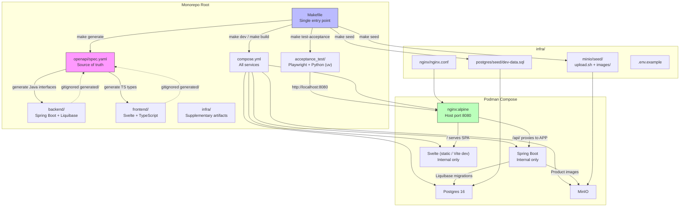
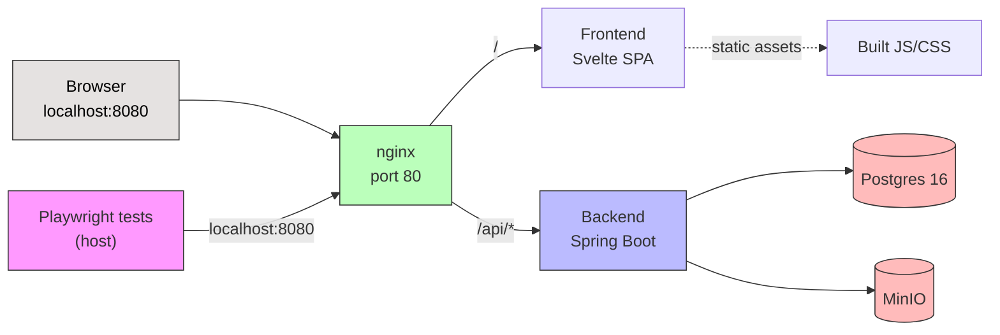

# Clothingshop — Infrastructure Product Requirements Document

## Visual Overview



## Context

**Product name:** Clothingshop
**Infrastructure role:** Self-hosted, containerized monorepo deployment
**Scope:** Proof-of-concept — minimal operational overhead, maximum developer experience consistency.

This document captures the infrastructure requirements for the Clothingshop MVP. It was developed through a structured brainstorming process (see `brainstorm-infra-session.md`) that resolved tensions between developer velocity, environment parity, and production-readiness for a self-hosted PoC. The core tension was discipline vs. pragmatism — every decision landed on the side of structured simplicity.

---

## 1. Goals & Non-Goals

### Goals

- SHALL provide a reproducible development environment via a single command (`make dev`)
- SHALL enforce an API contract between frontend and backend via OpenAPI code generation
- SHALL maintain environment parity between development and production-like states
- SHALL separate infrastructure concerns (routing, persistence, storage) from application code
- SHALL provide a seed mechanism for reproducible sample data
- SHALL provide end-to-end acceptance tests validating the full stack integration

### Non-Goals

- Multi-node orchestration (Swarm, Kubernetes) — out of scope for PoC
- CI/CD pipeline — may be added post-MVP
- Secrets management beyond `.env` files — out of scope for PoC
- Monitoring, logging, or observability infrastructure — out of scope for PoC
- CDN or reverse-proxy caching layer — out of scope for PoC

---

## 2. Repository Architecture

### 2.1 Monorepo Structure

```
simple_shop/
├── compose.yml                     # Podman Compose — all services
├── Makefile                        # Task runner — single entry point
├── .editorconfig                   # Tabs for Makefile, spaces elsewhere
├── .env                            # Local environment variables (gitignored)
├── .gitignore                      # Includes generated/ directories
│
├── openapi/
│   └── spec.yaml                   # OpenAPI spec — source of truth
│
├── backend/
│   ├── Dockerfile                  # Multi-stage: dev + prod targets
│   ├── build.gradle                # or pom.xml
│   └── src/
│       └── main/
│           ├── generated/          # Auto-generated from OpenAPI (gitignored)
│           │   ├── model/          # Java DTOs
│           │   └── api/            # Java interfaces
│           ├── java/               # Hand-written application code
│           └── resources/
│               └── db/
│                   └── changelog/  # Liquibase migration files
│
├── frontend/
│   ├── Dockerfile                  # Multi-stage: dev + prod targets
│   ├── package.json
│   ├── vite.config.ts
│   └── src/
│       ├── api/
│       │   └── generated/          # Auto-generated TS client (gitignored)
│       └── ...                     # Svelte components, stores, etc.
│
├── infra/
│   ├── .env.example                # Environment variable template
│   ├── nginx/
│   │   └── nginx.conf              # Reverse proxy configuration
│   ├── postgres/
│   │   └── seed/
│   │       └── dev-data.sql        # Sample product/order data
│   └── minio/
│       └── seed/
│           ├── upload.sh           # mc upload script
│           └── images/             # Sample product images
│               ├── product1.jpg
│               └── product2.jpg
│
├── acceptance_test/
│   ├── pyproject.toml              # uv project config, pytest-playwright dep
│   ├── conftest.py                 # Shared fixtures (base URL, browser config)
│   └── tests/
│       └── test_critical_path.py   # PoC: happy path end-to-end tests
│
└── docs/                           # Project documentation (optional)
```

### 2.2 Directory Responsibilities

| Directory | Owner | Purpose |
|-----------|-------|---------|
| `openapi/` | Shared | API contract — single source of truth for both frontend and backend |
| `backend/` | Backend team | Spring Boot application, Liquibase migrations, generated Java interfaces |
| `frontend/` | Frontend team | Svelte + TypeScript SPA, generated TypeScript client |
| `infra/` | Infrastructure | Supplementary artifacts: nginx config, seed data, environment templates |
| `acceptance_test/` | Shared | End-to-end acceptance tests (Playwright + Python), validates full stack |
| Root | Shared | `compose.yml`, `Makefile`, `.editorconfig`, `.gitignore` |

### 2.3 OpenAPI Spec Distribution

The OpenAPI spec resides at `openapi/spec.yaml`. Both frontend and backend generators reference it by relative path — **no symlinks**.

| Consumer | Generator | Relative path to spec | Output directory |
|----------|-----------|----------------------|-----------------|
| Frontend | openapi-generator-cli (typescript-fetch) | `../openapi/spec.yaml` | `frontend/src/api/generated/` |
| Backend | openapi-generator-cli (spring) | `../openapi/spec.yaml` | `backend/src/main/generated/` |

---

## 3. Functional Requirements

### 3.1 Container Orchestration

- SHALL use a single `compose.yml` file at the repository root
- SHALL target Podman Compose as the runtime (Compose v3 spec compatible)
- SHALL NOT require Swarm, Kubernetes, or any multi-node orchestration
- SHALL define the following services:

| Service | Image / Build | Internal port | Published port | Notes |
|---------|--------------|---------------|----------------|-------|
| `proxy` | `nginx:alpine` | 80 | 8080 | Reverse proxy — only published port |
| `backend` | `./backend` (multi-stage) | 8080 | none | Spring Boot API |
| `frontend` | `./frontend` (multi-stage) | 3000 (dev) / 80 (prod) | none | Svelte SPA |
| `db` | `postgres:16` | 5432 | none | Product catalog, orders |
| `minio` | `minio/minio` | 9000 / 9001 | none | Product images (S3-compatible) |

- All application containers SHALL be on a shared internal network
- Only the `proxy` service SHALL publish a port to the host

### 3.2 Reverse Proxy (nginx)

- SHALL serve the frontend SPA on `/`
- SHALL proxy `/api/*` requests to the backend service
- SHALL support WebSocket connections in dev mode (for Vite HMR)
- Configuration SHALL reside at `infra/nginx/nginx.conf`

**Routing rules:**

| Route | Target | Behavior |
|-------|--------|----------|
| `/` | `frontend` container | Serves static assets (prod) or proxies to Vite dev server (dev) |
| `/api/*` | `backend:8080` | Proxies API requests; strips `/api` prefix if backend serves on `/` |
| `/ws` (dev only) | `frontend:3000` | WebSocket upgrade for HMR |

### 3.3 OpenAPI Contract-First Development

- SHALL define the API contract in `openapi/spec.yaml` before any endpoint implementation
- SHALL auto-generate TypeScript types and HTTP client for the frontend
- SHALL auto-generate Java interfaces and DTOs for the backend
- Generated code SHALL be excluded from version control (gitignored)
- Generation SHALL be a prerequisite for compilation — enforced via the Makefile

**Generation workflow:**

1. Developer edits `openapi/spec.yaml`
2. Runs `make generate` (or it runs automatically as a dependency of `make dev` / `make build`)
3. Generated files appear in `frontend/src/api/generated/` and `backend/src/main/generated/`
4. Application compiles against generated types

### 3.4 Database Management

- SHALL use Liquibase for schema migration management
- Migrations SHALL reside in `backend/src/main/resources/db/changelog/`
- Migrations SHALL execute automatically on backend startup
- Schema ownership SHALL belong to the backend application — not the infrastructure layer
- Database credentials SHALL be configurable via environment variables

### 3.5 Object Storage (MinIO)

- SHALL provide an S3-compatible API for product image storage
- Bucket configuration SHALL be handled by the application or init scripts
- Access credentials SHALL be configurable via environment variables
- Sample images for development SHALL be loadable via `make seed`

### 3.6 Development Seed Data

- SHALL provide a `make seed` target that populates the development environment with sample data
- SQL seed data SHALL reside in `infra/postgres/seed/dev-data.sql`
- Sample product images SHALL reside in `infra/minio/seed/images/`
- MinIO upload SHALL use the `mc` client executed inside the MinIO container (no host dependency)
- Seed operations SHALL be idempotent (safe to run multiple times)
- Seed data SHALL be treated as a test contract — acceptance tests depend on it

### 3.7 Acceptance Testing

- SHALL provide end-to-end acceptance tests using Playwright (Python) with `uv` as package manager
- Tests SHALL execute on the host machine (not containerized) against the running compose stack at `http://localhost:8080`
- Tests SHALL rely on seed data loaded via `make seed` — no separate test fixture framework
- PoC scope SHALL cover the critical user journey (happy path): browse → product detail → acquire → cart → checkout → confirmation
- Directory structure SHALL support future expansion to error/edge case scenarios without restructuring

**Test prerequisites (documented, not automated):**

1. `make dev` — start the full stack
2. `make seed` — load sample data
3. `make test-acceptance` — run acceptance tests

**Directory structure:**

```
acceptance_test/
├── pyproject.toml              # uv project: pytest, pytest-playwright
├── conftest.py                 # Shared fixtures (base_url, browser config)
└── tests/
    └── test_critical_path.py   # 5-8 happy path tests (~100-200 lines)
    # Future: test_errors.py, test_cart.py, test_admin.py
```

**conftest.py SHALL provide reusable fixtures from the start:**
- Base URL configuration
- Browser launch options
- Page object helpers for common interactions

### 3.8 Build Pipeline

- SHALL provide a root-level Makefile as the single entry point for all operations

**Required Make targets:**

| Target | Dependencies | Description |
|--------|-------------|-------------|
| `setup` | `generate`, `build` | First-time project setup after clone |
| `generate` | none | Run OpenAPI code generation for both frontend and backend |
| `dev` | `generate` | Start all services in dev mode (volume mounts, hot-reload) |
| `build` | `generate` | Build all container images (prod targets) |
| `seed` | none | Load sample data into Postgres and MinIO |
| `test-acceptance` | none | Run Playwright acceptance tests on host (requires dev + seed) |
| `clean` | none | Stop containers, remove volumes, delete generated code |

### 3.9 Dockerfiles

- SHALL use multi-stage builds with distinct `dev` and `prod` targets

**Backend Dockerfile (Spring Boot):**

| Stage | Base image | Purpose | Features |
|-------|-----------|---------|----------|
| `dev` | Eclipse Temurin JDK 21 | Development runtime | spring-boot-devtools, volume mount for hot-reload |
| `build` | Eclipse Temurin JDK 21 | Compilation | Runs `./gradlew build`, OpenAPI generation |
| `prod` | Eclipse Temurin JRE 21 (slim) | Production runtime | Minimal image, no build tools |

**Frontend Dockerfile (Svelte):**

| Stage | Base image | Purpose | Features |
|-------|-----------|---------|----------|
| `dev` | node:20-alpine | Development server | Vite dev server with HMR, volume mount for hot-reload |
| `build` | node:20-alpine | Build | Runs `npm run build`, produces static assets |
| `prod` | nginx:alpine | Static file serving | Serves built SPA, copies from build stage |

---

## 4. Non-Functional Requirements

| Category | Requirement |
|----------|-------------|
| **Environment parity** | Dev and prod containers share the same images; only runtime configuration differs |
| **Host dependencies** | Core dev: Podman + Make only. Acceptance tests additionally require Python 3.12+, uv, and Playwright browsers |
| **Reproducibility** | `git clone && make setup && make dev` produces a fully running environment |
| **Startup time** | `make dev` reaches a usable state in under 60 seconds (excluding first-time image pulls) |
| **Hot-reload** | Code changes in `backend/src/` and `frontend/src/` reflect in the running application without manual restart |
| **Cross-platform** | Compose file compatible with both Podman Compose and Docker Compose |
| **Resource efficiency** | Total dev stack uses no more than 2 GB RAM at idle |

---

## 5. Technical Considerations

| Area | Decision / Note |
|------|----------------|
| Container runtime | Podman (rootless), Compose v3 spec |
| Reverse proxy | nginx:alpine — single published port, no CORS |
| Frontend serving | Vite dev server (dev), nginx static (prod) |
| API routing | nginx proxies `/api/*` to backend; prefix stripping configurable |
| Database | Postgres 16 — schema managed by Liquibase in backend |
| Object storage | MinIO — S3-compatible, self-hosted |
| State management | Cart state stored client-side (localStorage) — no backend session |
| OpenAPI generation | openapi-generator-cli — TypeScript fetch client + Spring interfaces |
| Generated code | Gitignored — generation is a build prerequisite |
| Symlinks | Not used — generators reference spec by relative path |
| Task runner | GNU Make — zero-install on Linux, universal |
| Migration tool | Liquibase — schema ownership in backend, runs on startup |
| Seed data | Manual via `make seed` — SQL inserts + MinIO mc upload. Also serves as acceptance test fixture data |
| Environment config | `.env` file (gitignored) with `.env.example` template |
| Acceptance tests | Playwright (Python) + uv, host-based, critical path for PoC, expandable post-MVP |

---

## 6. Environment Variables

Template provided in `infra/.env.example`:

| Variable | Purpose | Example |
|----------|---------|---------|
| `POSTGRES_DB` | Database name | `clothingshop` |
| `POSTGRES_USER` | Database user | `shop` |
| `POSTGRES_PASSWORD` | Database password | (generate per environment) |
| `SPRING_DATASOURCE_URL` | JDBC connection string | `jdbc:postgresql://db:5432/clothingshop` |
| `MINIO_ROOT_USER` | MinIO access key | `minioadmin` |
| `MINIO_ROOT_PASSWORD` | MinIO secret key | (generate per environment) |
| `MINIO_BUCKET` | Product images bucket name | `products` |
| `NGINX_PORT` | Host port for nginx | `8080` |

---

## 7. Network Architecture



**Network topology:**
- Single internal network (`clothingshop-net`)
- All inter-service communication uses Docker DNS service names
- Only nginx is reachable from the host
- Database and MinIO are not exposed to the host

---

## Decisions Log

Decisions made during infrastructure brainstorming that override or clarify the original PRD:

| # | Decision | Context |
|---|----------|---------|
| 1 | Contract-first OpenAPI (strict) | Both frontend and backend generate from spec. Strongest consistency, requires generation pipeline. |
| 2 | Generated code gitignored | Keeps git history clean. Generation is enforced as a build prerequisite via Makefile. |
| 3 | Compose-only orchestration | No Swarm, no K8s. Single compose.yml at repo root. Correct ceiling for a self-hosted PoC. |
| 4 | All-container dev workflow | Everything runs in containers, even in dev. Environment parity by default. Volume mounts for hot-reload. |
| 5 | nginx reverse proxy | Eliminates CORS, single origin, mirrors production. Only nginx publishes a host port. |
| 6 | Backend owns schema (Liquibase) | Schema migrations coupled to application code. Runs on startup. PRD mentioned Postgres but not migration strategy. |
| 7 | GNU Make as task runner | Zero-install, universal. `make dev/build/seed/clean` are the only entry points. |
| 8 | No symlinks for OpenAPI spec | Generators reference `../openapi/spec.yaml` by relative path. Avoids platform fragility. |
| 9 | Seed data separate from migrations | SQL file + MinIO upload script in `infra/`. Idempotent, run via `make seed`. |
| 10 | Multi-stage Dockerfiles | `dev` target with hot-reload tools, `prod` target with minimal runtime. Single Dockerfile per service. |
| 11 | Host-based Playwright acceptance tests | Faster iteration and debugging than containerized. uv as package manager. Breaks zero-host-dep for test workflow only. |
| 12 | Seed data as test fixture | `dev-data.sql` is dual-purpose: dev sample data and acceptance test data. Coupling accepted for PoC. |
| 13 | Critical path scope for PoC, expandable post-MVP | 5-8 happy path tests initially. Directory structure supports growth to error/edge case scenarios. |

---

## Unexplored Threads

These items surfaced during brainstorming but were not resolved:

1. **Dockerfile implementation details** — concrete multi-stage Dockerfile structure, base image pinning, layer caching strategy, where OpenAPI generation fits in the container build
2. **CI/CD pipeline** — automated testing, linting, image builds, and deployment triggers. May be unnecessary for PoC but should be considered for the Makefile structure
3. **Secrets management** — `.env` files are sufficient for PoC but a self-hosted production deployment would need a more robust approach
4. **Monitoring and logging** — no observability infrastructure discussed. Relevant for debugging in a self-hosted environment
5. **Backup and disaster recovery** — database dumps, MinIO bucket sync, restore procedures for the self-hosted deployment
6. **SSL/TLS termination** — nginx currently serves HTTP only. Production would require certificate management
7. **Podman-specific networking** — rootless mode DNS, port forwarding, and inotify behavior on bind mounts may require specific configuration
