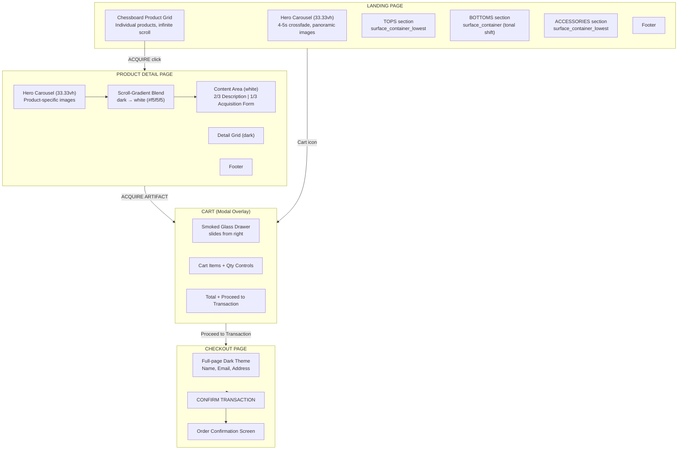

# Clothingshop — UI/UX Product Requirements Document

## Visual Overview

## Context

**Role:** Clothing brand product owner
**Brand:** Clothingshop
**Creative North Star:** "The Obsidian Monolith" — academic austerity meets high-fashion corporate gothicism.

This document captures the UI/UX specification for the Clothingshop MVP e-commerce application. It was developed through a structured brainstorming process that resolved tensions between the initial PRD (`prd-shop-proposal.md`), the design system (`docs/frontend/*/DESIGN.md`), and the HTML mockups (`docs/frontend/*/code.html`). The core tension was mood-first vs. commerce-first design — every decision landed on the side of usability while preserving the dark, editorial aesthetic.

---

## Design System Reference

### Color Palette: The Tonal Void

| Token | Hex | Usage |
|-------|-----|-------|
| `surface_container_lowest` | `#0e0e0e` | Primary backdrop, darkest surface |
| `surface_dim` | `#131313` | Secondary background |
| `surface_container_low` | `#1c1b1b` | Input field backgrounds, elevated surface |
| `surface_container` | `#201f1f` | Category section tonal shift, cards |
| `surface_container_high` | `#2a2a2a` | Dropdowns, hover dropdowns |
| `surface_container_highest` | `#353534` | Cart panel (with 90% opacity + blur) |
| `primary` | `#ffb4a8` | Interactive highlights, focus states |
| `primary_container` | `#5c0000` | CTA buttons ("Acquire"), accent elements |
| `on_primary_fixed_variant` | `#920703` | CTA hover state, gradient endpoint |
| `on_surface` | `#e5e2e1` | Primary text on dark backgrounds |
| `on_secondary_container` | `#b6b5b4` | Secondary body text |
| `outline` | `#a68a86` | Input underlines (default state) |
| `outline_variant` | `#57423e` | Ghost borders (15% opacity only) |
| Content white | `#f5f5f5` | Product page content area background |

**Key rules:**
- No 1px solid borders for sectioning. Boundaries defined solely through background shifts.
- CTA buttons use a subtle gradient: `primary_container` (#5c0000) → `on_primary_fixed_variant` (#920703) for velvet depth.
- Cart modal uses `surface_container_highest` at 90% opacity with 12px backdrop blur (smoked glass).

### Typography: Geometric Authority

| Role | Font | Usage |
|------|------|-------|
| Display & Headline | **Space Grotesk** (300-700) | Product titles, nav links, section headers, CTA labels |
| Body & Label | **Manrope** (200-600) | Descriptions, form inputs, metadata |

**Key rules:**
- `display-lg` (3.5rem) used sparingly for scale.
- All CTA labels in `title-sm`, all-caps, `0.1em` letter spacing.
- `label-md` and `label-sm` always all-caps.
- Product prices in `headline-sm` for weight.

### Elevation: Tonal Layering

No visible shadows. Depth conveyed through tonal contrast between surface tiers:
- A `surface_container_highest` card on `surface_dim` background = "lift" via grey contrast.
- Ambient shadows for floating elements only: 40px blur, 10% opacity, `#000000`.
- Ghost border fallback: `outline_variant` (#57423e) at 15% opacity — felt, not seen.

---

## Page Specifications

### 1. Global Header (Fixed)

**Present on:** All pages.

| Element | Spec |
|---------|------|
| Brand name | "CLOTHINGSHOP" — Space Grotesk, bold, tracking-[0.2em], uppercase, `#e5e2e1` |
| Nav links | TOPS, BOTTOMS, ACCESSORIES — Space Grotesk, tracking-tighter, uppercase, `text-sm` |
| Hover state | Text transitions to `#ffb4a8`, background shifts to `#1c1c1c` |
| Sub-category dropdowns | On hover: `surface_container_high` background, `primary_container` 2px top border, fade-in 300ms |
| Sub-categories | TOPS: Shirts, Knitwear. COATS: Jackets, Overcoats. BOTTOMS: Pants, Skirts, Trousers. ACCESSORIES: Belts, Bags, Jewelry. |
| Admin icon | Material Symbols Outlined, wght 200, `admin_panel_settings` glyph, navigates to Admin Panel (Section 6) |
| User icon | Material Symbols Outlined, wght 200, `person` glyph |
| Cart icon | Material Symbols Outlined, wght 200, `shopping_bag` glyph + item count badge (`primary_container` bg) |
| Height | `h-20` (80px) |
| Background | `#0e0e0e`, `z-50`, fixed top |
| Border radius | All interactive elements: `0px` (no rounded corners) |

### 2. Landing Page

#### 2.1 Hero Carousel

| Property | Value |
|----------|-------|
| Combined height (header + carousel) | `33.33vh` |
| Carousel height alone | `33.33vh - 80px` (header height) |
| Behavior | 4-5s auto-rotation with 300ms crossfade transition |
| Interaction | Pause on hover, resume on leave |
| Image treatment | Panoramic/cinematic crops (~21:9 or wider), `grayscale brightness-50` |
| Overlay text | Collection name in `display-lg` Space Grotesk, centered, semi-transparent |
| Progress indicators | Thin bars at bottom-right: `primary_container` (active), `surface_variant` (inactive) |
| Scroll hint | Subtle animated line (`primary` to transparent gradient) below carousel |

#### 2.2 Chessboard Product Grid

| Property | Value |
|----------|-------|
| Pattern | Alternating rows: image-left / image-right |
| Row layout (odd) | Image (1/3 width) left + Content (2/3 width) right |
| Row layout (even) | Content (2/3 width) left + Image (1/3 width) right |
| Image treatment | `opacity-80`, `mix-blend-luminosity`, hover: `scale-105` over 700ms |
| Image column | Full-bleed, no padding, `surface_container_high` background behind image |
| Content column | `pl-24` (odd rows) / `pr-24` + `text-right` (even rows) |

**Product Card Content:**

| Element | Spec |
|---------|------|
| Product name | Space Grotesk, bold, tracking-tighter, uppercase, large display size |
| Description | Manrope, light, tracking-wide, 2-3 lines, editorial tone |
| Price | Space Grotesk, bold, prominent positioning near ACQUIRE button |
| ACQUIRE button | `primary_container` bg, `on_surface` text, `0px` radius, all-caps, `tracking-[0.2em]`, hover → `on_primary_fixed_variant` |

**Category Separation:**
- Products sorted: TOPS → BOTTOMS → ACCESSORIES
- Category boundaries signaled by **tonal shift** in background color
- TOPS: `surface_container_lowest` (#0e0e0e)
- BOTTOMS: `surface_container` (#201f1f)
- ACCESSORIES: `surface_container_lowest` (#0e0e0e)
- No text labels or dividers — background tone alone defines the boundary

**Infinite Scroll:**
- Subtle loading indicator at viewport bottom
- Text: "CONTINUE EXPLORING THE VOID" in `label-sm` all-caps
- Animated `expand_more` icon in `primary` color
- Products loaded progressively as user scrolls

#### 2.3 Footer

| Element | Spec |
|---------|------|
| Links | INVENTORY, TRANSACTIONS, LEGAL, MANIFESTO |
| Style | Manrope, `text-[10px]`, uppercase, `tracking-[0.3em]` |
| Default color | `#353534` |
| Hover | `#e5e2e1`, 700ms transition |
| MANIFESTO link | Always `#ffb4a8` (primary) |
| Copyright | "© MMXXIV CLOTHINGSHOP. ALL RIGHTS RESERVED." |

### 3. Product Detail Page

#### 3.1 Hero Carousel

| Property | Value |
|----------|-------|
| Height | `33.33vh` |
| Type | Product-specific image carousel |
| Behavior | Same as landing page: 4-5s crossfade, pause on hover |
| Image treatment | `grayscale brightness-50 contrast-125` |
| Bottom gradient | `bg-gradient-to-t from-surface_container_lowest/80 to-transparent` |
| Progress indicators | Same thin bars as landing page |

#### 3.2 Scroll-Gradient Blend

The product page's signature transition. As the user scrolls past the hero, the background gradually shifts from dark (`#0e0e0e`) to white (`#f5f5f5`). This is implemented as a gradient overlay or scroll-triggered opacity transition spanning approximately one viewport height.

**Effect:** The darkness *recedes* rather than snapping. The product content area emerges from the void.

#### 3.3 Content Area (White Background — `#f5f5f5`)

**Layout:** Two-column split within a `max-w-7xl` container.

**Left Column (2/3 width) — Product Narrative:**

| Section | Spec |
|---------|------|
| Series label | "Series 01 / Artifact 04" — Space Grotesk, `text-[10px]`, uppercase, `tracking-[0.4em]`, `primary_container` color |
| Product title | Space Grotesk, `text-6xl`, bold, tracking-tighter, uppercase, `leading-none` |
| Manifesto | Border-left: 2px `primary_container`. Editorial product description, Manrope, `text-lg`, light weight |
| Fabrication | 2-column grid. Heading: Space Grotesk, `text-xs`, uppercase, `tracking-[0.2em]`. Content: Manrope, `text-sm`, light |
| Ethics | Same layout as Fabrication. Environmental impact, production details |

**Right Column (1/3 width) — Acquisition Form:**

Sticky positioning (`sticky top-32`).

| Element | Spec |
|---------|------|
| Silhouette dropdown | Full-width, underline-only style, `surface_container_low` bg. Options: Boxy/Architectural, Tailored/Clinical, Oversized/Monastic |
| Waist input | Underline-only, `surface_container_low` bg, placeholder "--", numeric text input, label in Space Grotesk `text-[10px]` uppercase |
| Hips input | Same style as Waist. In same row as Waist (2-column grid) |
| Height input | Full-width, same underline style. Below Waist/Hips row |
| Price display | "Transaction Value" label + price in Space Grotesk, `text-2xl`, bold. Separated by `surface_variant/10` top border |
| ACQUIRE ARTIFACT button | Full-width, `primary_container` bg, `on_surface` text, `py-6`, all-caps, gradient hover effect (`primary_container` → `#920703`) |
| Shipping note | "Complimentary secure transit for all global acquisitions." — Manrope, `text-[10px]`, uppercase, `tracking-widest`, 40% opacity |

**Input Focus States:**
- Default underline: `surface_variant/30`
- Focus underline: transitions to `primary_container`
- No focus ring (`focus:ring-0`)

#### 3.4 Detail Grid (Below Content — Dark Background)

Returns to dark aesthetic (`surface_container_lowest`). Asymmetric 12-column grid:
- Col 1 (7 cols): Large product detail image, `grayscale opacity-60`
- Col 2 (5 cols): Secondary image with offset (`mt-24`), `surface_container_high` background

### 4. Cart (Modal Overlay)

**Present on:** All pages. Consistent design everywhere.

| Property | Value |
|----------|-------|
| Type | Slide-in drawer from right |
| Width | `450px` (desktop), full-width (mobile) |
| Background | `surface_container_highest` (#353534) at 90% opacity + heavy backdrop blur |
| Transition | `translate-x-full` → `translate-x-0`, 500ms duration |
| Backdrop | `bg-black/60 backdrop-blur-sm`, click to close |
| Header | "CURRENT INVENTORY" — Space Grotesk, bold, `text-2xl`, tracking-tighter, uppercase |
| Close button | Material Symbols `close` glyph, `on_surface` color, hover → `primary` |
| Item separator | No dividers. 24px vertical padding between items |

**Cart Item:**
| Element | Spec |
|---------|-------|
| Thumbnail | 96×128px, `grayscale brightness-50` |
| Item label | Series/Artifact ID in `primary_container`, `text-[10px]` uppercase |
| Item name | Space Grotesk, `text-sm`, bold, uppercase |
| Size/variant | Manrope, `text-[10px]`, uppercase, tracking-widest, 60% opacity |
| Quantity control | Inline: `[−] count [+]` with `surface_variant/20` border |
| Price | Space Grotesk, bold, `text-sm` |

**Cart Footer:**
| Element | Spec |
|---------|-------|
| Total label | "TOTAL VALUE" — Manrope, `text-xs`, tracking-widest, uppercase |
| Total amount | Space Grotesk, bold, `text-xl`, uppercase |
| Separator | `outline/20` top border |
| PROCEED TO TRANSACTION | Full-width, `primary_container` bg, `on_surface` text, `py-5`, all-caps, Space Grotesk |

**Empty State:**
- Centered `inventory_2` icon (60px), 30% opacity
- "INVENTORY IS CURRENTLY EMPTY" — Manrope, `text-sm`, uppercase, tracking-widest

### 5. Checkout Page

| Property | Value |
|----------|-------|
| Type | Full-page (navigated from cart) |
| Background | Dark — `surface_container_lowest` (#0e0e0e) |
| Aesthetic | Same dark theme as the rest of the site |

**Form Fields (underline-only inputs):**

| Field | Style |
|-------|-------|
| Full Name | Underline input, `surface_container_low` bg, `on_surface` text |
| Email | Same style |
| Shipping Address | Same style, multi-line or two fields |
| Focus state | Underline transitions from `outline` to `primary` |

**Order Summary (top of page):**
- List of cart items with thumbnails, names, quantities, prices
- Subtotal display

**CONFIRM TRANSACTION button:**
- Same styling as ACQUIRE ARTIFACT — `primary_container` bg, gradient hover, all-caps

**Post-Submission:**
- Order confirmation screen
- Success state with order ID
- "Return to Inventory" link

### 6. Admin Panel

Entry via the `admin_panel_settings` icon in the Global Header (placed next to the user icon). No hero carousel.

#### 6.0 Panel Shell (Shared Layout)

| Property | Value |
|----------|-------|
| Layout | Two-column: 1/3 sidebar (`w-64`, 256px) + 2/3 main content pane |
| Sidebar background | `neutral-950` / `surface_container_low` (#0e0e0e) |
| Main content background | `surface_container_lowest` (#0e0e0e) |
| Top nav bar | Fixed `h-20`, shows current section title instead of brand name, search bar, `admin_panel_settings` + `account_circle` icons |

**Sidebar:**

| Element | Spec |
|---------|------|
| Title | "INVENTORY" — Space Grotesk, bold, `text-xl`, uppercase, tracking-tighter |
| Subtitle | "CORPO GOTH ADMIN" — Space Grotesk, `text-[10px]`, uppercase, tracking-[0.2em], `neutral-500` |
| Menu items | "ADD NEW PRODUCT" (`add_box` icon), "MODIFY/DELETE PRODUCT" (`edit_document` icon) |
| Active state | `bg-red-950`, `text-neutral-100`, `font-bold`, `scale-95` |
| Inactive state | `text-neutral-500`, hover → `bg-neutral-800` |
| Menu text | Space Grotesk, uppercase, tracking-tighter |

**Sidebar footer:** Operator info block — `SYS` badge (`primary_container` bg, `on_surface` text), "OPERATOR" label, operator identifier. Border-top `neutral-900`.

**Structural decoration:** Fixed right-edge gradient line — `w-1 h-screen bg-gradient-to-b from-primary_container via-transparent to-transparent opacity-20`.

#### 6.1 Product Registration (Add New Product)

A dedicated form for registering new artifacts in the system.

**Layout:** Two-column grid (`lg:grid-cols-2`) within `max-w-6xl` container, `p-12`, `gap-x-16 gap-y-12`.

**Page Header:**

| Element | Spec |
|---------|------|
| Title | "PRODUCT REGISTRATION" — Space Grotesk, `text-4xl`, font-black, uppercase, tracking-tighter |
| Accent bar | `h-1 w-24`, `primary_container` bg, `mt-4` |

**Form Fields — Identification Cluster (Left Column):**

| Field | Label | Type | Style |
|-------|-------|------|-------|
| Name | "PRODUCT IDENTITY" | Line edit | Underline-only, Space Grotesk, `text-lg`, uppercase, tracking-tighter, placeholder "NAME" |
| Short Description | "PRECISE ABSTRACT" | Line edit | Underline-only, Manrope, `text-sm`, placeholder "SHORT DESCRIPTION" |
| Price | "VALUATION" | Dropdown | Underline-only, options: PLN / EUR / USD, Space Grotesk, tracking-widest, uppercase |
| Category | "TAXONOMY" | Dropdown | Underline-only, options: Tops / Coats / Bottoms / Accessories, same style as Price |
| Is Active | "STATUS: ACTIVE INVENTORY" | Checkbox | Custom: `w-5 h-5`, `border-outline/30`, checked → `bg-primary-container`, `check` Material Symbol overlay. Label: Space Grotesk, `text-[10px]`, uppercase, tracking-[0.2em] |

Labels: Space Grotesk, `text-[10px]`, uppercase, tracking-[0.3em], `outline` color. Price and Category share a 2-column sub-grid.

**Form Fields — Rich Text & Specifications Cluster (Right Column):**

| Field | Label | Type | Style |
|-------|-------|------|-------|
| Description | "THE NARRATIVE" | Rich text edit (HTML-compatible, injection-resilient) | `surface_container_low` bg, `border-l-2 border-outline/10`, `min-h-[160px]`. Toolbar: bold/italic/list Material Symbol icons, `hover:text-primary_container` |
| Fabric & Manufacturing | "MATERIALITY" | Rich text edit | `surface_container_low` bg, `border-outline-variant/10`, `h-32`, `overflow-y-auto`, Manrope `text-xs` |
| Fabrication Care | "PRESERVATION" | Rich text edit | Same style as Materiality. Shares 2-column sub-grid with it |

**Full-Width Row — Ethics & Origin:**

Separated by `border-t border-outline-variant/10 pt-12`. Two-column sub-grid, `gap-16`.

| Field | Label | Type | Style |
|-------|-------|------|-------|
| Ethics Origin | "PROVENANCE" | Line edit | Underline-only, Space Grotesk, tracking-widest, uppercase, placeholder "ETHICS ORIGIN" |
| Ethics Impact | "SOCIETAL RESONANCE" | Line edit | Same style, placeholder "ETHICS IMPACT" |

**Full-Width Row — Visual Documentation (Asset Drop Area):**

| Property | Value |
|----------|-------|
| Label | "VISUAL DOCUMENTATION" — same label style |
| Drop area | `h-64`, `border-2 border-dashed border-outline-variant/20`, `surface_container_lowest` bg. Hover → `bg-surface_container_low`. Centered `upload_file` icon + instructional text in Space Grotesk `text-[10px]` uppercase |
| Thumbnail preview grid | `grid-cols-4`, uploaded images as `aspect-square`, `surface_container` bg, `border-outline-variant/10`, `grayscale`. Empty slots: dashed placeholders |
| Validation | At least one image is mandatory |

**Submit Button:**

| Property | Value |
|----------|-------|
| Label | "ADD PRODUCT" |
| Style | `primary_container` bg, `on_surface` text, `px-16 py-6`, Space Grotesk, font-black, `text-sm`, tracking-[0.3em], uppercase |
| Hover | `bg-on_primary_fixed_variant`, `-translate-y-1` lift, `shadow-2xl` |
| Active | `scale-95` |
| Position | `lg:col-span-2`, right-aligned, separated by `border-t border-outline-variant/10` |

#### 6.2 Inventory Management (Modify/Delete Product)

A pageable dashboard for overviewing the archive, with one-click actions for updating or removing items.

**Page Header:**

| Element | Spec |
|---------|------|
| Title | "INVENTORY MANAGEMENT" — Space Grotesk, `text-4xl`, bold, uppercase, tracking-tighter |
| Subtitle | Manrope, `text-sm`, `neutral-500`, descriptive text, `max-w-xl` |
| Stats (right-aligned) | "TOTAL ASSETS" label: `text-[10px]`, `primary` color + count: `text-3xl`, Space Grotesk |

**Inventory Table:**

| Property | Value |
|----------|-------|
| Container | `surface_container_lowest` bg, `overflow-hidden` |
| Header row | `surface_container_high` bg, `text-[10px]`, `neutral-400`, uppercase, tracking-[0.2em], Manrope label font |
| Row hover | `bg-surface_container`, image: `grayscale-0 opacity-100` (from `grayscale opacity-80`) over 500ms |
| Row separator | `divide-y divide-surface-variant/10` |

**Table Columns:**

| Column | Header Label | Content |
|--------|-------------|---------|
| Asset | "ASSET" | Thumbnail: `w-16 h-20`, `surface_container_high` bg, `grayscale opacity-80`, hover: full color over 500ms |
| Identity | "IDENTITY" | Product name: Space Grotesk, bold, `text-sm`, tracking-tight. SKU: Manrope, `text-[10px]`, `neutral-500`, uppercase, tracking-widest |
| Classification | "CLASSIFICATION" | Short description: Manrope, `text-xs`, `neutral-400`, `max-w-xs`, leading-relaxed |
| Modified | "MODIFIED" | Date: Manrope, `text-xs`, `neutral-500`, uppercase. Time: Manrope, `text-[10px]`, `primary/60`, tracking-tighter |
| Directives | "DIRECTIVES" (right-aligned) | Update + Delete buttons |

**Action Buttons:**

| Button | Style |
|--------|-------|
| Update | `primary_container` bg, `on_surface` text, `px-4 py-2`, `text-[10px]`, Manrope bold, uppercase, tracking-widest, `edit` Material Symbol icon. Hover → `bg-on_primary_fixed_variant` |
| Delete | Transparent bg, `border-outline/20`, `text-neutral-500`, `px-4 py-2`, `text-[10px]`, Manrope bold, uppercase, tracking-widest. Hover → `text-error`, `border-error` |

**Update action:** Opens a modal overlay with the same form structure as Section 6.1 (Product Registration), pre-populated with the selected product's current data.

**Delete action:** Removes the item and refreshes the table.

**Pagination:**

| Property | Value |
|----------|-------|
| Container | `px-8 py-6`, `surface_container_low` bg, `border-t border-surface-variant/10` |
| Info (left) | "DISPLAYING X-Y OF Z UNITS" — Manrope, `text-[10px]`, `neutral-500`, tracking-widest, uppercase |
| Controls (right) | Page number buttons: `w-10 h-10`, `border-outline/10`, Space Grotesk. Active: `border-primary text-primary bg-primary-container/20`. Chevron buttons (`chevron_left`/`chevron_right`) at edges |
| Backend | Cursor-based pagination (Spring `Slice<>`, no COUNT queries — per AGENTS.md) |

**Admin Footer Fragment:**

Three-column grid below the table (`mt-12`, `grid-cols-3`, `gap-8`) with system metadata:

| Card | Label | Value |
|------|-------|-------|
| System Status | "SYSTEM STATUS" | "SYNCHRONIZED" — pulsing `primary` dot + text |
| Access Level | "ACCESS LEVEL" | "SUPER_ADMINISTRATOR" |
| Data Integrity | "DATA INTEGRITY" | "VALIDATED_100%" |

Card style: `surface_container_low` bg, `p-6`. Labels: Manrope, `text-[10px]`, `neutral-500`, uppercase, tracking-widest. Values: Space Grotesk, `text-sm`, `neutral-300`, uppercase, tracking-tight.

### 7. Mobile Behavior (320px+)

| Component | Behavior |
|-----------|----------|
| Header | Brand name + hamburger menu icon. Nav links collapse into slide-out menu |
| Nav dropdowns | Tap to expand (no hover on touch) |
| Hero carousel | Full-width, maintains 33.33vh height |
| Chessboard product grid | Collapses to vertical card list: image on top, text below, full-width |
| Product page | Single column: hero → description → acquisition form below |
| Cart | Full-width slide-in panel |
| Checkout | Single column form |

---

## Component Specifications

### Buttons

| Type | Background | Text | Radius | Hover |
|------|-----------|------|--------|-------|
| Primary (ACQUIRE) | `primary_container` | `on_surface` | `0px` | Gradient shift → `on_primary_fixed_variant` |
| Secondary | `transparent` | `on_surface` | `0px` | `outline` at 20% opacity border appears |

- All button text: Space Grotesk, all-caps, `tracking-[0.2em]`, `text-xs` to `text-sm`
- Active state: `scale-95` press effect
- No rounded corners on any interactive element

### Input Fields

| State | Underline | Background |
|-------|----------|------------|
| Default | `surface_variant/30` | `surface_container_low` (dark pages) / transparent (white pages) |
| Focus | `primary_container` | Same |
| Error | TBD — unexplored |

- Labels: Space Grotesk, `text-[10px]`, uppercase, `tracking-[0.3em]`, bold
- Placeholder: "--" (double dash)
- No focus ring

### Dropdown Menus (Nav Sub-categories)

| Property | Value |
|----------|-------|
| Background | `surface_container_high` (#2a2a2a) |
| Top border | 2px `primary_container` |
| Transition | Opacity + visibility, 300ms |
| Links | Manrope, `text-xs`, `tracking-widest`, uppercase, hover → `primary` color |

---

## Language & Voice

| Standard term | Clothingshop term |
|---------------|-------------------|
| Buy Now / Add to Cart | **ACQUIRE** |
| Cart | **CURRENT INVENTORY** |
| Add to Cart (product page) | **ACQUIRE ARTIFACT** |
| Checkout | **PROCEED TO TRANSACTION** |
| Confirm Order | **CONFIRM TRANSACTION** |
| Subtotal | **TOTAL VALUE** / **Transaction Value** |
| Shipping | **Secure transit** |
| Products | **INVENTORY** / **Artifacts** |

---

## Decisions Log

Decisions made during brainstorming that override or clarify the original PRD:

| # | Decision | Context |
|---|----------|---------|
| 1 | Hero height = 33.33vh (header + carousel combined) | PRD specified this; mockup was ~921px. Confirmed PRD value. |
| 2 | Individual products directly in chessboard | PRD specified individual products; mockup showed 3 category blocks. Confirmed PRD. |
| 3 | Cart = always dark smoked glass | Mockups were inconsistent (dark on landing, white on product). Unified to dark. |
| 4 | Carousel = 4-5s crossfade | PRD said 1s linear. Corrected to editorial-standard pace. |
| 5 | Product page = scroll-gradient blend (dark → white) | Resolves the jarring dark-to-white shift. Gradual transition via scroll. |
| 6 | Product card = editorial & spacious | 2-3 line descriptions, large display type, price + ACQUIRE per row. |
| 7 | Form fields = Waist + Hips + Height | PRD specified 3 measurements; mockup had 2. Confirmed PRD. |
| 8 | Mobile = vertical card list | Chessboard collapses to stacked cards on mobile. |
| 9 | Checkout = full-page dark theme | Separate page, not in-cart. Maintains aesthetic through entire funnel. |
| 10 | Category separation = tonal shift | Background color alternates between category groups. No text dividers. |

---

## Unexplored Threads

These items surfaced during brainstorming but were not resolved:

1. **Order confirmation screen** — design of the post-purchase success state
2. **Error/validation states** — how form errors manifest with underline-only inputs
3. **Empty states** — landing page with zero products, category with no items
4. **Lookbook Fragment** — editorial asymmetric grid section from mockup; deferred to post-MVP
5. **Breadcrumb navigation** — whether product pages show navigation path
6. **Product page carousel** — whether it shares the same behavior as the landing page carousel or is manual-only
